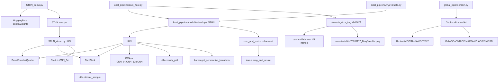
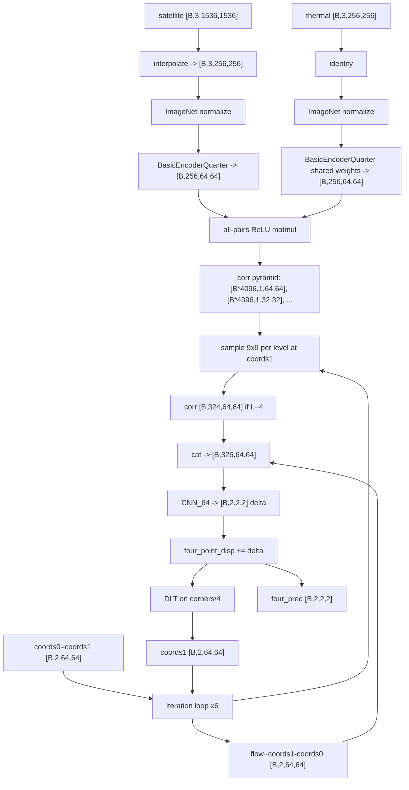
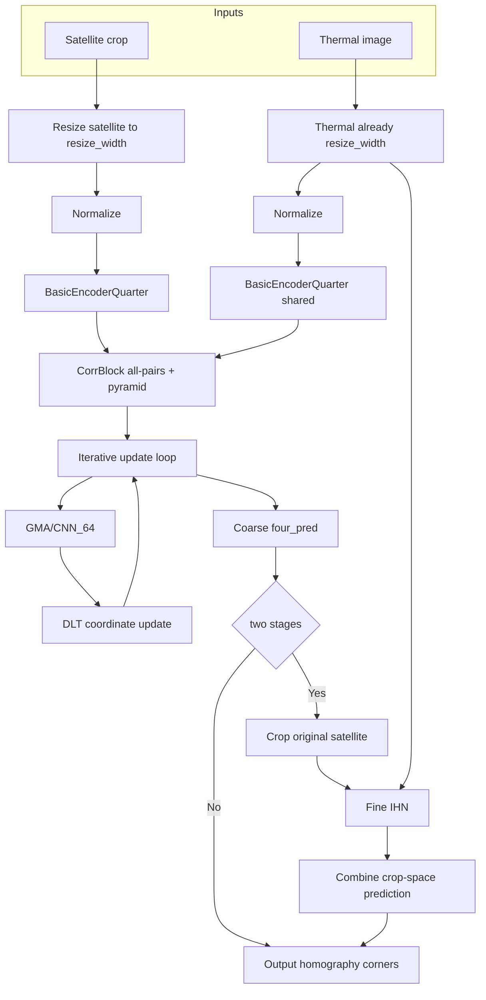
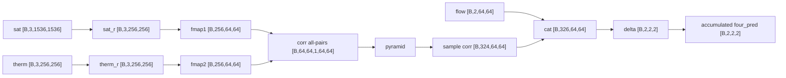
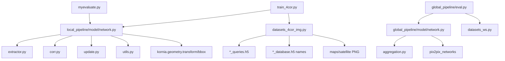
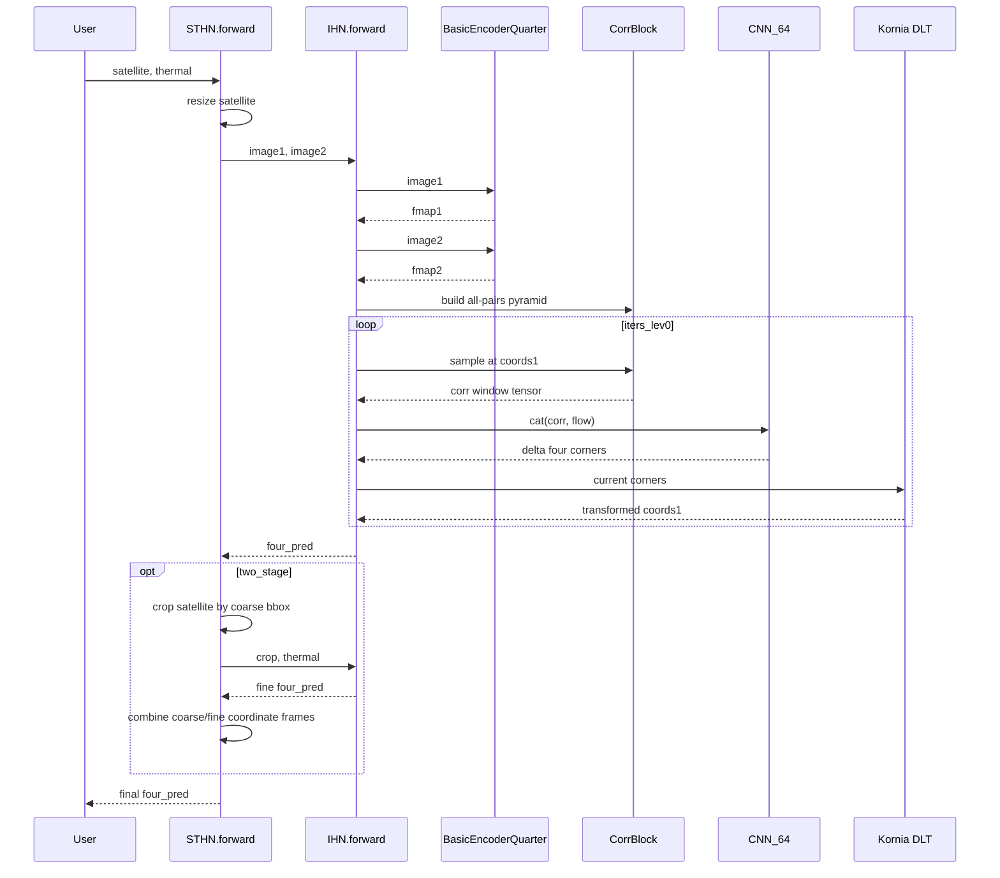
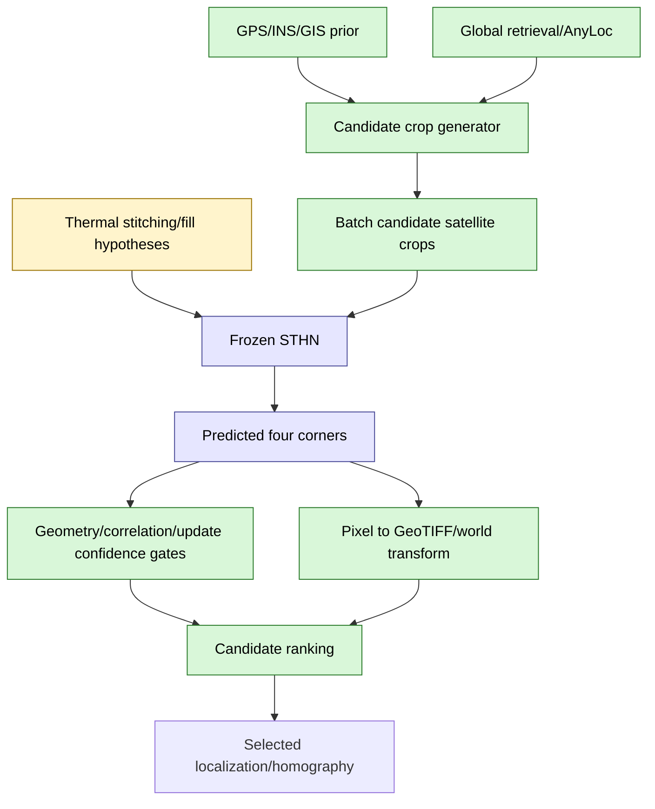
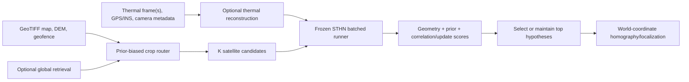

# STHN Implementation Architecture And No-Retraining Steering Analysis

This document reverse-engineers the implementation in this repository. It is not a paper summary. Claims are grounded in the checked source files, especially:

- `STHN_demo.py`
- `local_pipeline/model/network.py`
- `local_pipeline/extractor.py`
- `local_pipeline/corr.py`
- `local_pipeline/update.py`
- `local_pipeline/datasets_4cor_img.py`
- `local_pipeline/train_4cor.py`
- `local_pipeline/myevaluate.py`
- `global_pipeline/model/network.py`
- `global_pipeline/datasets_ws.py`
- `global_pipeline/test.py`
- `global_pipeline/anyloc/utilities.py`
- `keypoint_pipeline/myloftr/model/network.py`
- `keypoint_pipeline/myr2d2/model/network.py`
- `experiments/missing_data_eval.py`
- `experiments/scaled_observation_eval.py`

Static analysis note: the active shell Python does not have `torch` installed, so tensor-shape checks in this report are derived from the source rather than executed in this environment. The repository environment is specified in `env.yml`.

## Part 1 - Project Structure

### Main Entry Points

| Entry point | Role | Actual pipeline |
|---|---|---|
| `STHN_demo.py` | Clean pretrained inference wrapper with HuggingFace loading | One-stage or two-stage STHN homography inference on example images |
| `local_pipeline/train_4cor.py` | Main STHN training script | Loads H5/map crops, trains `local_pipeline.model.network.STHN` |
| `local_pipeline/myevaluate.py` | Intended local STHN evaluation | Loads checkpoint and evaluates MACE/center error, but currently appears stale because line 106 calls `model.set_input(img1, img2, flow_gt, image1_ori)` while `STHN.set_input` accepts only `(A, B, flow_gt)` in `local_pipeline/model/network.py:212` |
| `local_pipeline/evaluate.py` | Validation during training | Uses `model.set_input(...)`, `model.forward()`, computes MACE |
| `global_pipeline/train.py` | Global image-retrieval baseline training | Backbone plus aggregation, triplet/SARE losses, optional DANN |
| `global_pipeline/eval.py` | Global retrieval evaluation | Extract descriptors, FAISS search, optional geographic prior threshold |
| `global_pipeline/eval_anyloc.py` | AnyLoc/DINOv2/VLAD baseline | DINOv2 patch descriptors plus VLAD |
| `global_pipeline/train_pix2pix.py` | Thermal generation model training | Pix2Pix U-Net generator and PatchGAN discriminator |
| `global_pipeline/eval_pix2pix.py`, `eval_pix2pix_generate_h5.py` | Pix2Pix eval or generated H5 creation | Generate thermal-like query images |
| `global_pipeline/h5_transformer.py`, `h5_merger.py` | Dataset construction | Crop maps into H5 records with UTM-like coordinate names |
| `keypoint_pipeline/myloftr/myevaluate.py` | LoFTR baseline evaluation | Kornia LoFTR matches, OpenCV RANSAC homography |
| `keypoint_pipeline/myr2d2/myevaluate.py` | R2D2 baseline evaluation | R2D2 descriptors, BFMatcher, OpenCV RANSAC homography |
| `experiments/missing_data_eval.py` | Frozen model missing-data experiment | Loads `STHN_demo.STHN`, masks inputs, computes metrics |
| `experiments/scaled_observation_eval.py` | Frozen model scaled-observation experiment | Loads pretrained STHN, creates thermal mosaics, computes metrics |

### Implementation Caveats Found During Trace

These are code-level observations that affect how confidently a file can be treated as runnable:

- `STHN_demo.py` is the cleanest pretrained inference path. It redefines `GMA`, `IHN`, and `STHN` to remove the `args` dependency while keeping checkpoint key compatibility.
- `local_pipeline/myevaluate.py` appears stale: it calls `model.set_input(img1, img2, flow_gt, image1_ori)` at line 106, but `local_pipeline/model/network.py::STHN.set_input` accepts only `(A, B, flow_gt)`.
- `local_pipeline/datasets_4cor_img.py::_find_img_in_h5(..., database)` references `self.database_folder_h5_df`, but the active local dataset path comments out that handle and uses `_find_img_in_map` for positives. Reenabling database H5 image loading would need repair.
- `global_pipeline/eval_pix2pix.py` contains an indented top-level `model = network.pix2pix(args, 3, 1)` line, which appears syntactically invalid as written.
- `global_pipeline/model/network.py::GeoLocalizationNetRerank` references `R2Former`, `AnySizePatchEmbed`, `pos_resize`, and `partial`, but this file does not import them. The definitions exist in `global_pipeline/model/r2former.py`, so the class looks incomplete unless imported elsewhere before use.

### Important Folders

| Folder | Contents |
|---|---|
| `local_pipeline/` | The implemented STHN homography network, local H5/map dataset, training, evaluation, losses, correlation, update CNN |
| `global_pipeline/` | Retrieval baselines, Pix2Pix thermal generation, H5 generation, AnyLoc baseline, optional transformer/reranking code |
| `keypoint_pipeline/` | LoFTR and R2D2 style image matching baselines |
| `experiments/` | Frozen-pretrained model robustness experiments for missing pixels and scaled partial observations |
| `scripts/` | Slurm scripts for local STHN, global retrieval, Pix2Pix, and evaluation |
| `cache/vocabulary/...` | AnyLoc/DINOv2 VLAD vocabulary cache |
| `examples/` | Demo input/output images |

### Implemented Input To Output Pipeline

The main STHN inference path is:

1. Input satellite crop: `[B, 3, database_size, database_size]`, usually `[B, 3, 1536, 1536]`.
2. Input thermal image: `[B, 3, resize_width, resize_width]`, usually `[B, 3, 256, 256]`.
3. Satellite crop is resized to `[B, 3, resize_width, resize_width]`.
4. Both images are ImageNet-normalized inside `IHN.forward`.
5. Shared CNN feature extractor `BasicEncoderQuarter` produces two feature maps `[B, 256, resize_width/4, resize_width/4]`.
6. `CorrBlock` computes all-pairs feature correlation once, then samples local correlation neighborhoods around the current coordinate estimate.
7. `GMA` update block is actually a CNN, not attention. It receives sampled correlation plus current flow and predicts a 4-corner displacement increment `[B, 2, 2, 2]`.
8. The corner displacement is accumulated over `iters_lev0` iterations, default 6.
9. `get_flow_now_4` converts the current 4-corner displacement into a perspective transform and updates the dense feature-grid coordinate field.
10. One-stage output is `four_pred: [B, 2, 2, 2]`, in `resize_width` pixel units.
11. If two-stage is enabled, the coarse result crops the original satellite image, runs a second `IHN` with `corr_level=2`, and maps the fine crop-space displacement back into the original satellite crop coordinate system.

### Dependency Graph

### File Classification

| Category | Files |
|---|---|
| Model definitions | `local_pipeline/model/network.py`, `STHN_demo.py`, `local_pipeline/extractor.py`, `local_pipeline/corr.py`, `local_pipeline/update.py`, `global_pipeline/model/network.py`, `global_pipeline/model/aggregation.py`, `global_pipeline/model/r2former.py`, `keypoint_pipeline/*/model/network.py` |
| Preprocessing and datasets | `local_pipeline/datasets_4cor_img.py`, `global_pipeline/datasets_ws.py`, `global_pipeline/h5_transformer.py`, `global_pipeline/h5_merger.py`, `STHN_demo.py` preprocessing functions |
| Feature extraction | `BasicEncoderQuarter` in `local_pipeline/extractor.py`; global retrieval backbones in `global_pipeline/model/network.py`; DINOv2 in `global_pipeline/anyloc/utilities.py`; LoFTR/R2D2 in `keypoint_pipeline` |
| Matching/correlation | `local_pipeline/corr.py::CorrBlock`; `global_pipeline/test.py` FAISS retrieval; `keypoint_pipeline` OpenCV/Kornia matching |
| Homography estimation | `local_pipeline/model/network.py::IHN.get_flow_now_4`, `STHN_demo.py::IHN.get_flow_now_4`, `kornia.geometry.transform.get_perspective_transform`; keypoint baselines use `cv2.findHomography` |
| Refinement stages | Two-stage crop logic in `local_pipeline/model/network.py:240-294` and `STHN_demo.py:204-249` |
| Inference scripts | `STHN_demo.py`, intended `local_pipeline/myevaluate.py`, `global_pipeline/eval.py`, `global_pipeline/eval_anyloc.py`, keypoint `myevaluate.py`, experiments under `experiments/` |
| Training-only logic | `local_pipeline/train_4cor.py`, `sequence_loss` and optimizer in `local_pipeline/utils.py`, `global_pipeline/train.py`, `global_pipeline/train_pix2pix.py`, Pix2Pix discriminator/losses |

## Part 2 - Module Breakdown

### `STHN_demo.py::STHN`

- File: `STHN_demo.py:146`
- Learned weights: yes, through `netG` and optional `netG_fine`.
- Input:
  - `satellite_image: [B, 3, database_size, database_size]`, values `[0, 1]`.
  - `thermal_image: [B, 3, resize_width, resize_width]`, values `[0, 1]`.
- Output:
  - `four_pred: [B, 2, 2, 2]`, layout `[batch, x/y, top/bottom, left/right]`, in resized image pixel units.
- Internal assembly:
  - `F.interpolate` satellite to `[B, 3, resize_width, resize_width]`.
  - Run `netG = IHN(resize_width, corr_level)`.
  - Optional two-stage:
    - `_crop_for_refinement` crops original satellite using coarse result.
    - `netG_fine = IHN(resize_width, 2)` runs on crop plus same thermal input.
    - `_combine_coarse_fine` maps fine result back to original coordinate frame.
- Replaceability:
  - Wrapper logic is replaceable without retraining if `netG` input/output conventions are preserved.
  - `netG` and `netG_fine` architectures are checkpoint-coupled.

### `local_pipeline/model/network.py::STHN`

- File: `local_pipeline/model/network.py:163`
- Role: Training/evaluation class around one or two `IHN` modules.
- Learned weights:
  - `netG`: yes.
  - `netG_fine`: yes when `args.two_stages`.
  - Optimizer/scheduler only created with `for_training=True`.
- Important fixed tensors:
  - `four_point_org_single: [1, 2, 2, 2]` at `resize_width`.
  - `four_point_org_large_single: [1, 2, 2, 2]` at `database_size`.
- `set_input(A, B, flow_gt)`:
  - `A`: satellite crop `[B, 3, database_size, database_size]`.
  - `B`: thermal query `[B, 3, resize_width, resize_width]`.
  - Resizes `A` to `self.image_1: [B, 3, resize_width, resize_width]`.
  - Extracts ground-truth four-corner flow from dense `flow_gt` if present.
- `forward`:
  - One-stage: `netG(image_1, image_2)`.
  - Two-stage: crop original satellite, run `netG_fine`, combine.
- Can be replaced independently:
  - Outer class can be modified for candidate looping, crop control, and postprocessing.
  - Replacing `netG` requires matching checkpoint architecture.

### `local_pipeline/model/network.py::IHN`

- File: `local_pipeline/model/network.py:22`; simplified mirror in `STHN_demo.py:58`.
- Purpose: Iterative Homography Network.
- Learned components:
  - Shared feature extractor `BasicEncoderQuarter`.
  - Update block `GMA`.
- Fixed components:
  - ImageNet normalization tensors.
  - `CorrBlock` construction.
  - DLT via Kornia.
  - Coordinate-grid update logic.
- Input:
  - `image1: [B, 3, resize_width, resize_width]`, satellite resized/crop.
  - `image2: [B, 3, resize_width, resize_width]`, thermal.
- Output:
  - `four_point_predictions`: list of `iters_lev0` tensors `[B, 2, 2, 2]`.
  - `four_point_disp: [B, 2, 2, 2]`.
- Internal architecture:
  - Normalize both images.
  - Feature extraction:
    - `fmap1 = fnet1(image1)`.
    - `fmap2 = fnet1(image2)`.
  - Build `CorrBlock(fmap1, fmap2, num_levels=corr_level, radius=4)`.
  - Initialize `coords0 = coords1 = coords_grid(B, H/4, W/4)`.
  - Initialize `four_point_disp = 0`.
  - For each iteration:
    - `corr = corr_fn(coords1)`.
    - `flow = coords1 - coords0`.
    - `delta_four_point = update_block_4(corr, flow)`.
    - Add delta to four-corner displacement.
    - Convert corners to a homography and update `coords1` through `get_flow_now_4`.
- Interaction point:
  - Thermal and satellite first interact inside `CorrBlock.corr`, after independent shared-weight CNN feature extraction.
- Replaceability:
  - `iters_lev0` can be changed at inference, with drift risk.
  - `corr_level` cannot be changed unless the update CNN first layer matches the channel count.
  - `corr_radius` is effectively fixed at 4 for loaded weights, because input channels are `corr_level * (2*radius+1)^2 + 2`.

### `local_pipeline/extractor.py::BasicEncoderQuarter`

- File: `local_pipeline/extractor.py:177`.
- Purpose: Shared CNN feature extractor for both modalities.
- Learned weights: yes.
- Input: `[B, 3, H, W]`, usually `[B, 3, 256, 256]`.
- Output: `[B, output_dim, H/4, W/4]`, usually `[B, 256, 64, 64]`.
- Internal architecture:
  - `Conv2d(3, 64, kernel=7, stride=1, padding=3)`.
  - norm selected by `norm_fn`, STHN uses `instance`.
  - ReLU.
  - MaxPool 2.
  - Residual layer with 2 `ResidualBlock`s at 64 channels.
  - MaxPool 2.
  - Residual layer with 2 `ResidualBlock`s at 96 channels.
  - `Conv2d(96, output_dim, kernel=1)`.
- Dependencies:
  - `ResidualBlock`.
  - PyTorch `F.max_pool2d`.
- Coupling:
  - Strongly coupled to learned weights and to the downstream correlation distribution.
  - It is shared between satellite and thermal. Replacing or modifying it breaks checkpoint compatibility.
- Note:
  - `BasicEncoder` also exists but is not used by current STHN path. It outputs `H/8` features if used.

### `local_pipeline/extractor.py::ResidualBlock`

- File: `local_pipeline/extractor.py:5`.
- Purpose: Two-convolution residual block with optional downsample.
- Input/output:
  - `[B, in_planes, H, W]` to `[B, planes, H/stride, W/stride]`.
- Learned weights: yes.
- Internal:
  - 3x3 conv, norm, ReLU.
  - 3x3 conv, norm, ReLU.
  - 1x1 downsample branch always created in this implementation.
- Replaceability:
  - Not independently replaceable under frozen weights.

### `local_pipeline/corr.py::CorrBlock`

- File: `local_pipeline/corr.py:14`.
- Purpose: Dense all-pairs feature correlation plus local-window sampling at multiple correlation pyramid scales.
- Learned weights: no.
- Input at construction:
  - `fmap1: [B, C, h, w]`.
  - `fmap2: [B, C, h, w]`.
- Internal all-pairs correlation:
  - Flatten features to `[B, C, h*w]`.
  - Compute `ReLU(fmap1^T fmap2)` producing `[B, h*w, h*w]`.
  - Reshape to `[B, h, w, 1, h, w]`, then `[B*h*w, 1, h, w]`.
- Pyramid:
  - Level 0: `[B*h*w, 1, h, w]`.
  - Each next level uses `avg_pool2d(..., 2, stride=2)`.
- Runtime input:
  - `coords: [B, 2, h, w]`, absolute current coordinate estimates in feature-grid pixels.
- Runtime output:
  - `[B, num_levels * (2*radius+1)^2, h, w]`.
  - For `num_levels=4`, `radius=4`: `[B, 324, 64, 64]`.
  - For `num_levels=2`, `radius=4`: `[B, 162, 64, 64]`.
- Dependencies:
  - `utils.bilinear_sampler`.
- Replaceability:
  - Computation can be wrapped, cached, masked, or post-weighted.
  - Output channel count is tightly coupled to `GMA` first convolution.
  - Correlation value distribution is coupled to update CNN training.

### `local_pipeline/update.py::GMA`

- File: `local_pipeline/update.py:291`.
- Important naming note: this is not graph matching attention in the current code path. It is a dispatcher to CNN regressors.
- Learned weights: yes.
- Input:
  - `corr: [B, L*81, h, w]`.
  - `flow: [B, 2, h, w]`.
  - Concatenated input: `[B, L*81+2, h, w]`.
- Output:
  - `delta_flow` or `delta_four_point: [B, 2, 2, 2]`.
- Dispatch:
  - If `sz == 32`: `CNN` or `CNN_weight`.
  - If `sz == 64`: `CNN_64` or `CNN_weight_64`.
  - If `sz == 128`: `CNN_128`.
- Current common setup:
  - `resize_width=256`, so `sz=64`.
  - `corr_level=4`, so input channels are `326`.
  - `CNN_64(128, init_dim=326)` is used.
- Coupling:
  - Strongly checkpoint-coupled.
  - First conv channel count binds `corr_level` and `corr_radius`.
  - Spatial size binds `resize_width`.

### `local_pipeline/update.py::CNN_64`

- File: `local_pipeline/update.py:208`.
- Purpose: Regress four-point displacement increment from correlation and flow.
- Learned weights: yes.
- Input:
  - `[B, init_dim, 64, 64]`, usually `[B, 326, 64, 64]`.
- Output:
  - `[B, 2, 2, 2]`.
- Internal architecture:
  - Five repeated blocks:
    - 3x3 Conv to 128 channels.
    - GroupNorm.
    - ReLU.
    - MaxPool 2.
  - Spatial path: `64 -> 32 -> 16 -> 8 -> 4 -> 2`.
  - `layer10`: 3x3 Conv, GroupNorm, ReLU, 1x1 Conv to 2 channels.
- Replaceability:
  - Not safe under frozen weights.
  - Can be run more times through `IHN` loop, but the block itself should not be changed.

### `local_pipeline/update.py::CNN_128`, `CNN`, `CNN_weight`, `CNN_weight_64`

- Files:
  - `CNN_128`: `local_pipeline/update.py:156`.
  - `CNN`: `local_pipeline/update.py:251`.
  - weighted variants: `local_pipeline/update.py:5` and `74`.
- Purpose:
  - Alternate update heads for `resize_width=512` (`sz=128`), `resize_width=128` (`sz=32`), or optional spatial weighting.
- Caveats:
  - `CNN_128` first conv is hardcoded to `164`, so it matches `corr_level=2`, `radius=4`, plus 2 flow channels.
  - Weighted paths are defined but not used by default scripts.
- Replaceability:
  - Architecture is checkpoint-coupled.
  - Weighted variants add an internal learned spatial weight map and are not interchangeable with unweighted checkpoints.

### Homography And Coordinate Update

- Files:
  - `local_pipeline/model/network.py::IHN.get_flow_now_4`, lines 37-61.
  - `STHN_demo.py::IHN.get_flow_now_4`, lines 72-102.
- Learned weights: no.
- Input:
  - `four_point: [B, 2, 2, 2]`, in `resize_width` pixels.
- Output:
  - `flow: [B, 2, h, w]`, but semantically this is the transformed absolute coordinate field `coords1`, not a displacement field.
- Process:
  - Divide `four_point` by 4 to map to feature-grid units.
  - Build canonical four corners over feature map.
  - Add displacement to corners.
  - Compute perspective transform with Kornia.
  - Apply transform to every feature-grid coordinate.
  - Return transformed x/y coordinate maps.
- Replaceability:
  - Safe to inspect and use for postprocessing.
  - Risky to change because update CNN was trained with exactly this coordinate convention.

### Inference Helper Functions

#### `local_pipeline/utils.py::coords_grid`

- File: `local_pipeline/utils.py:35`.
- Learned weights: no.
- Input:
  - `batch`, `ht`, `wd`.
- Output:
  - Coordinate tensor `[B, 2, ht, wd]`, where channel 0 is x and channel 1 is y.
- Inference role:
  - Initializes `coords0` and `coords1` in `IHN.forward`.
  - Defines the coordinate convention used by `flow = coords1 - coords0`.
- Replaceability:
  - Do not change axis ordering without retraining or adapting all homography code.

#### `local_pipeline/utils.py::bilinear_sampler`

- File: `local_pipeline/utils.py:18`.
- Learned weights: no.
- Input:
  - `img: [N, C, H, W]`.
  - `coords: [N, h, w, 2]` in pixel coordinates.
- Output:
  - Sampled tensor via `F.grid_sample`.
- Inference role:
  - Used by `CorrBlock.__call__` to sample correlation neighborhoods at current coordinates.
  - Converts pixel coordinates into normalized grid-sample coordinates with `align_corners=True`.
- Replaceability:
  - Boundary masking could be enabled or wrapped, but interpolation and `align_corners` convention should stay fixed for checkpoint-compatible behavior.

#### `local_pipeline/model/network.py::mywarp`

- File: `local_pipeline/model/network.py:335`.
- Learned weights: no.
- Input:
  - Image/tensor `x: [B, C, H, W]`.
  - `flow_pred` either dense `[B, 2, H, W]` or four-corner `[B, 2, 2, 2]`.
- Output:
  - Warped image `[B, C, H, W]`.
- Inference role:
  - Used only when `args.vis_all` for visualization in the local wrapper.
  - Not part of the numerical prediction unless visualization is enabled.
- Replaceability:
  - Safe for visualization and diagnostics.

#### `STHN_demo.py` preprocessing helpers

- Files:
  - `load_and_preprocess_satellite`: `STHN_demo.py:296`.
  - `load_and_preprocess_thermal`: `STHN_demo.py:305`.
- Learned weights: no.
- Satellite preprocessing:
  - PIL RGB.
  - Resize to `[database_size, database_size]`.
  - `ToTensor`.
- Thermal preprocessing:
  - PIL grayscale.
  - Convert to 3-channel grayscale.
  - Resize to `[resize_width, resize_width]`.
  - `ToTensor`.
- Replaceability:
  - Safe if final tensor scaling, channel count, shape, orientation, and crop-scale convention are preserved.

### Two-Stage Refinement Crop

- Files:
  - Training/eval wrapper: `local_pipeline/model/network.py:240-294`.
  - Clean demo wrapper: `STHN_demo.py:204-249`.
- Learned weights:
  - Crop math is fixed.
  - Fine `IHN` is learned.
- Input:
  - Original satellite crop `[B, 3, database_size, database_size]`.
  - Coarse `four_pred: [B, 2, 2, 2]` in resize-scale pixels.
- Output:
  - Cropped satellite `[B, 3, resize_width, resize_width]`.
  - `delta: [B, 1, 1, 1]`, crop-to-resize scale.
  - `flow_bbox: [B, 2, 2, 2]`, crop bbox displacement in database-scale pixels.
  - Final combined `four_pred` in original resize-scale coordinates.
- Important math:
  - `alpha = database_size / resize_width`.
  - Coarse corners are scaled into database pixels.
  - A square bbox enclosing the coarse quadrilateral is cropped.
  - `kappa = delta / alpha`.
  - `final = four_pred_fine * kappa + flow_bbox / alpha`.
- Replaceability:
  - The outer crop selection is one of the safest structural modification points.
  - `netG_fine` itself is checkpoint-coupled.

### Dataset Module `local_pipeline/datasets_4cor_img.py`

- Main classes:
  - `homo_dataset`: geometric target generation.
  - `MYDATA`: H5/map-backed dataset.
- Input sources:
  - Query images from `split_queries.h5`.
  - Satellite crops from `datasets/maps/satellite/20201117_BingSatellite.png`, not from database image data in active positive path.
  - H5 database file is used for image names and UTM coordinates.
- Returned training/eval tuple:
  - `img2`: satellite crop `[3, database_size, database_size]`.
  - `img1`: thermal query `[3, resize_width, resize_width]`.
  - `flow`: dense flow `[2, resize_width, resize_width]`.
  - `H`: homography matrix.
  - `query_utm`, `database_utm`, `index`, `pos_index`.
- Ground truth:
  - UTM delta is computed as `query_utm - database_utm`, then x/y are swapped.
  - Delta is divided by `alpha = database_size / resize_width`.
  - Four target corners depend on `database_size`. For `database_size=1536`, target corners are offset by about one third of `resize_width`, matching the inner thermal footprint inside a larger satellite crop.
  - Dense flow is generated by applying OpenCV perspective transform to all pixels.
- Search-related logic:
  - `soft_positives_per_query` uses `NearestNeighbors.radius_neighbors` with `val_positive_dist_threshold`.
  - If `prior_location_threshold != -1`, `hard_negatives_per_query` is constructed. In local STHN this is not used to perform full retrieval; positives are sampled from soft positives or cached pairs.
  - Candidate satellite crop is selected before network inference.
- Replaceability:
  - Very safe to replace for inference if it produces the same tensors and coordinate metadata.
  - This is the primary place to integrate GeoTIFF/GIS candidate generation.
- Implementation caveat:
  - `_find_img_in_h5(..., database)` references `self.database_folder_h5_df`, while the active dataset comments out that handle. The active positive path uses `_find_img_in_map`, so this bug is avoided unless database H5 image loading is reenabled.

### Loss And Training Utilities

- File: `local_pipeline/utils.py`.
- `sequence_loss`:
  - Input predictions list of `[B, 2, 2, 2]`.
  - Converts dense `flow_gt` into four corners.
  - Weighted L1 over iteration predictions using `gamma`.
  - Reports MACE, 1px, 3px.
- `single_loss`:
  - Single-prediction L1 variant.
- `fetch_optimizer`:
  - AdamW plus OneCycleLR.
- Inference coupling:
  - Loss is not needed at inference.
  - Metric code can be reused safely for candidate ranking and confidence analysis.

### Global Retrieval Module

- File: `global_pipeline/model/network.py`.
- Class: `GeoLocalizationNet`.
- Purpose: Global candidate retrieval baseline, not the local homography estimator.
- Input:
  - Images `[B, 3, H, W]`, default parser resize `[512, 512]`.
- Output:
  - Descriptor `[B, features_dim]`, after aggregation and optional FC/L2.
- Backbones:
  - ResNet18/50/101 conv4 or conv5.
  - VGG16, AlexNet.
  - CCT.
  - HuggingFace ViT.
  - DeiT special paths in `train.py`, `GeoLocalizationNetRerank`.
- Aggregation:
  - GeM, SPoC, MAC, RMAC, NetVLAD, CRN, RRM, identity-like modes.
- Optional modules:
  - `NonLocalBlock`.
  - Domain classifier via gradient reversal for DANN.
- Inference search:
  - `global_pipeline/test.py` computes database/query descriptors and uses FAISS.
  - If `prior_location_threshold != -1`, it builds a per-query FAISS index only over geographically nearby database indices.
- Replaceability:
  - Safe as a separate candidate generator for STHN.
  - Its weights are separate from local STHN weights.

### Pix2Pix Translation Module

- File: `global_pipeline/model/network.py::pix2pix`.
- Underlying implementation: `global_pipeline/model/pix2pix_networks/networks.py`.
- Purpose: Generate thermal-like images from satellite or train translation baseline, not part of `STHN_demo.py` inference.
- Generator:
  - `UnetGenerator(input_channel_num, output_channel_num, num_downs=8 or 9)`.
- Discriminator:
  - PatchGAN `NLayerDiscriminator`.
- Training losses:
  - GAN loss plus L1.
- Replaceability:
  - Safe to ignore for frozen STHN homography inference.
  - If used to generate extended data, it affects training data distribution, not the already frozen homography model.

### AnyLoc/DINOv2 Baseline

- Files:
  - `global_pipeline/eval_anyloc.py`.
  - `global_pipeline/anyloc/utilities.py`.
- Purpose: Retrieval baseline and possible candidate generator.
- DINOv2:
  - Uses `torch.hub.load('facebookresearch/dinov2', 'dinov2_vitg14')`.
  - Extracts layer 31 value descriptors by default.
- VLAD:
  - Cluster count `num_c=32`.
  - Vocabulary cache under `cache/vocabulary/dinov2_vitg14/l31_value_c32/thermal/c_centers.pt`.
- Replaceability:
  - Very suitable as an external no-retraining candidate generator for STHN.

### Keypoint Baselines

#### LoFTR

- File: `keypoint_pipeline/myloftr/model/network.py`.
- Uses `kornia.feature.LoFTR(pretrained="outdoor")`.
- In `myevaluate.py`, it:
  - Normalizes images.
  - Converts both to grayscale.
  - Runs LoFTR.
  - Calls `cv2.findHomography(mkpts0, mkpts1, cv2.RANSAC, 5.0)`.
  - Converts homography to four-corner displacement.
- Not part of STHN learned local path.

#### R2D2

- File: `keypoint_pipeline/myr2d2/model/network.py`.
- Uses `Quad_L2Net_ConfCFS`, reliability/repeatability losses, and `NghSampler2`.
- In `myevaluate.py`, it:
  - Extracts multiscale descriptors.
  - Uses OpenCV BFMatcher.
  - Uses RANSAC homography.
- Not part of STHN learned local path.

## Part 3 - Assembly Analysis

### High-Level Pipeline Diagram

### Tensor Flow Diagram

### Low-Level Execution Sequence

1. `STHN.forward(satellite_image, thermal_image)` receives already normalized-to-`[0, 1]` tensors in `STHN_demo.py`.
2. Satellite is resized with bilinear interpolation and antialiasing.
3. `IHN.forward(image1, image2)` creates ImageNet mean/std tensors lazily on the image device.
4. Satellite and thermal are normalized with the same ImageNet mean/std.
5. `BasicEncoderQuarter` runs independently on each image through shared weights.
6. `CorrBlock` computes a dense all-pairs correlation from the two final feature maps.
7. `coords0` and `coords1` are initialized as identical feature-grid coordinate maps.
8. `four_point_disp` starts at zero.
9. Per iteration:
   - Correlation is sampled near `coords1` at every feature-grid location.
   - Current feature-grid displacement is `coords1 - coords0`.
   - Correlation and flow are concatenated.
   - `CNN_64` predicts a new four-corner displacement increment.
   - The increment is accumulated in resized-image coordinates.
   - Kornia DLT turns the current corners into a perspective transform.
   - The perspective transform updates `coords1`.
10. The final one-stage displacement is returned.
11. If two-stage:
   - The coarse displacement is scaled into database pixels.
   - A square bbox around the coarse quadrilateral is cropped from the original satellite image.
   - The same thermal input is matched against the satellite crop by `netG_fine`.
   - The fine prediction is scaled and offset into original crop coordinates.

### Branching And Skip Connections

- `BasicEncoderQuarter` has internal residual skip connections in `ResidualBlock`.
- `CorrBlock` creates a correlation pyramid branch per level, then concatenates channels.
- `IHN` has an iterative loop but no recurrent hidden state.
- The two-stage wrapper branches after coarse prediction:
  - One branch returns directly in one-stage mode.
  - The other builds a satellite crop and runs a second IHN.
- There is no transformer, cross-attention, or learned feature fusion in the main local STHN path.
- Thermal/satellite fusion occurs only through correlation, not feature concatenation. The optional `args.fnet_cat` only batches both images together through the shared extractor for efficiency/normalization consistency.

### Where Decisions Emerge

| Decision | Location |
|---|---|
| Candidate satellite location | Outside STHN, in dataset pair selection or external retrieval/geographic prior |
| First satellite/thermal interaction | `CorrBlock.corr`, after CNN feature extraction |
| Local matching evidence | `CorrBlock.__call__`, sampled correlation windows |
| Homography update decision | `GMA`/`CNN_64`, which regresses corner deltas |
| Iterative geometric consistency | `get_flow_now_4`, DLT coordinate update |
| Refinement region | `_crop_for_refinement`, bbox around coarse predicted quadrilateral |
| Final homography refinement | `netG_fine` plus `_combine_coarse_fine` |

## Part 4 - Inference-Time Modification Analysis

This is the key result: the frozen local STHN model is a crop-to-crop homography estimator. It is not a full-map search model. Steering without retraining should happen primarily outside the learned modules.

### A. Search Biasing

#### Can We Constrain Candidate Regions?

Yes. This is the safest and most important lever.

The network accepts a satellite crop, not a whole map. In `local_pipeline/datasets_4cor_img.py`, the active positive path selects a `pos_index`, then `_find_img_in_map` crops `database_size x database_size` pixels around that map coordinate. Therefore, a geographic prior can select or restrict candidate crop centers before STHN runs.

Safe methods:

- Restrict candidate crop centers by UTM/GPS radius.
- Use a geofence polygon over map pixel coordinates.
- Use global retrieval only inside a prior region.
- Generate several candidate crops around the prior mean and run frozen STHN on each.
- Use `global_pipeline/test.py` style per-query FAISS over `hard_negatives_per_query` as a retrieval-stage prior.

High-value insertion points:

- Replace or wrap `_find_img_in_map` in local inference.
- Replace `pos_index` selection with a candidate list.
- Use `global_pipeline/datasets_ws.py` and `global_pipeline/test.py` retrieval as a first-stage candidate generator.
- Use GeoTIFF pixel-to-world transforms before crop generation and after prediction.

#### Can We Pre-Crop Satellite Regions?

Yes. This is exactly how the local model is designed.

Requirements for low risk:

- Preserve `database_size`, usually 1536 for the provided model.
- Preserve map orientation and pixel scale close to training data.
- Preserve channel order and `[0, 1]` tensor scaling.
- Produce square crops `[B,3,database_size,database_size]`.
- Keep `resize_width` fixed to checkpoint config.

Risk:

- Changing crop scale changes what a thermal footprint means relative to the satellite crop.
- The trained model encodes expected FOV/scale relationships through the data generation logic.

#### Can We Inject Geographic Priors?

Yes, but not as extra neural-network channels without retraining.

Safe priors:

- Candidate crop center prior.
- Candidate crop radius/stride.
- Candidate ordering.
- Candidate weights during ranking.
- Fine-stage crop padding.
- Rejection gates based on predicted geometry and prior-consistency.

Unsafe priors:

- Adding channels to image tensors.
- Changing `corr` channel count.
- Adding coordinate channels to `GMA`.
- Changing learned feature extractor inputs.

#### Where Can Map Metadata Influence Inference?

Map metadata can influence:

- Crop center generation.
- Crop scale if GeoTIFF resolution differs, but only after resampling back to training pixel scale.
- Crop orientation if the map is north-up and UAV yaw is known.
- Candidate region mask.
- Post-homography conversion from local crop pixels to global map coordinates.
- Candidate ranking by distance to prior.

It should not be inserted inside `BasicEncoderQuarter`, `CorrBlock`, or `CNN_64` unless used only as external weighting that preserves tensor shapes.

### B. Input Reconstruction

#### Can Multiple Thermal Frames Be Stitched Before Inference?

Technically yes. The model only requires `[B, 3, resize_width, resize_width]`.

The existing experiments already test related no-retraining manipulation:

- `experiments/missing_data_eval.py` masks/fills satellite or thermal inputs.
- `experiments/scaled_observation_eval.py` creates scaled thermal mosaics with `make_scaled_observation_mosaic`.

Practical constraints:

- The frozen model expects a single thermal observation at the trained FOV/scale.
- A stitched mosaic must be resampled into the same square canvas and should represent the same footprint convention.
- Large blank/no-data regions are out-of-distribution.
- Scale changes are risky. Existing scaled-observation experiments exist because this is not guaranteed to work.

Safe variants:

- Stitch frames into a single thermal canvas with known geometry.
- Fill holes with neutral/inpainted values.
- Run multiple reconstructed hypotheses and rank externally.

Risky variants:

- Arbitrary partial mosaics where objects appear at different scales.
- Canvas layouts that imply a different camera footprint.
- Non-square or uncalibrated FOV changes.

### C. Module Reordering

#### Can Refinement Loops Be Repeated?

Yes, because `iters_lev0` and `iters_lev1` are runtime arguments. The update block has no hidden state, and each iteration recomputes sampled correlation and flow from the current coordinate field.

Risk:

- The network was trained/evaluated with default 6 iterations.
- More iterations may overshoot, collapse the quadrilateral, or drift because the learned update is not guaranteed to be a convergent optimizer.

Recommended no-retraining experiment:

- Run `iters` in `{3, 6, 9, 12}`.
- Track geometry validity, corner update norm, center error proxy, and candidate ranking stability.
- Stop early if delta norm increases or polygon area becomes invalid.

#### Can Feature Extraction Be Reused Across Candidates?

Partially.

Safe:

- Reuse thermal feature map for the same query across many satellite candidates.
- Batch multiple satellite crops against one repeated thermal tensor.
- Cache satellite candidate features after resizing each crop to `resize_width`.
- Cache `CorrBlock` for repeated refinement iterations for the same pair. The code already does this inside a single `IHN.forward`.

Risky:

- Precomputing a whole-map feature grid and slicing from it is not equivalent to cropping a `database_size` patch, resizing it to `resize_width`, and then running the CNN. The resize operation changes local scale before feature extraction.
- Whole-map feature caching could be made approximately equivalent only if candidate crops are generated at a fixed scale and the resampling pipeline is replicated carefully.

#### Can Matching Stages Be Isolated?

Yes, with shape discipline.

You can run:

- `fnet1(image1)`, `fnet1(image2)`.
- `CorrBlock(fmap1, fmap2)`.
- `corr_fn(coords1)`.
- `update_block_4(corr, flow)`.

But:

- The update block expects the exact correlation-channel layout.
- It expects the same coordinate convention and scale.
- It has learned the distribution of ReLU correlations from `BasicEncoderQuarter`.

### D. Intermediate Feature Manipulation

#### Can Feature Maps Be Cached?

Yes.

Best caches:

- Thermal feature map per query.
- Satellite resized-crop feature map per candidate.
- Correlation pyramid per query-candidate pair if running multiple iteration schedules or rankers.

Memory warning:

- Level-0 all-pairs correlation for `64 x 64` features stores roughly `(4096 x 4096)` correlation values per batch item before pyramid pooling. This is expensive.

#### Can We Modify Correlation Behavior?

Limited.

Safe-ish:

- Multiply sampled correlation by a same-shape spatial prior or mask.
- Zero out invalid candidate regions after correlation sampling.
- Temperature/normalization experiments, if conservative and externally controlled.

High risk:

- Changing `corr_radius`, because channels change.
- Changing `corr_level`, because channels change and checkpoint first conv no longer matches.
- Removing ReLU in `CorrBlock.corr`, because the update CNN was trained on nonnegative correlations.
- Replacing correlation with cosine/scaled dot product without retraining.

#### Can We Inject Masks Or Spatial Weighting?

Input-space masks are safer than feature-space changes:

- Mask/fill/inpaint thermal or satellite pixels before inference.
- Candidate crop masks can reject crops that contain too much no-data.

Intermediate weighting is possible but riskier:

- `corr *= weight_map` preserves shape.
- `flow *= weight_map` is riskier because flow semantics change.
- Extra channels are not possible without retraining.

### E. GeoTIFF / GIS Integration

#### Where Could Terrain/Elevation Priors Be Inserted?

Safe insertion points:

- Candidate crop center prediction.
- Candidate crop scale selection.
- Candidate crop yaw/orientation normalization.
- Expected thermal footprint size.
- Post-homography plausibility gates.
- Candidate score prior.

Example frozen pipeline:

1. Convert UAV GPS/INS estimate to GeoTIFF pixel coordinates.
2. Use uncertainty ellipse plus DEM-derived altitude/FOV to generate candidate crop centers and crop scales.
3. Resample each crop to the trained `database_size` convention.
4. Run frozen STHN.
5. Convert predicted four corners back to GeoTIFF/world coordinates.
6. Rank by learned output proxies and geographic prior consistency.

#### Which Stages Operate In Coordinate Space?

- Dataset pairing and crop generation operate in UTM-like coordinates parsed from H5 `image_name`.
- `_find_img_in_map` converts center coordinates to map pixel crop bounds.
- `homo_dataset.__getitem__` converts UTM delta into four-corner displacement and dense flow.
- `get_flow_now_4` converts four-corner displacements into feature-grid coordinates.
- Two-stage `_crop_for_refinement` converts coarse corners into database pixel bbox.
- Metric code converts four-corner homographies into center error.

#### Which Stages Assume Raw Imagery Only?

- `BasicEncoderQuarter`.
- `CorrBlock`.
- `GMA`/`CNN_64`.
- Pix2Pix generator/discriminator.
- Keypoint detector/matcher networks.

These modules do not consume geospatial metadata.

### F. Search-Space Reduction

#### Which Module Currently Performs Implicit Search?

Inside local STHN:

- `CorrBlock` performs all-pairs feature matching inside one satellite crop.
- The update loop samples local correlation windows around the current coordinate estimate.

Outside local STHN:

- Candidate crop selection is done by dataset positive selection or retrieval baselines.
- The local model never searches the full satellite map.

#### How Can We Bias Or Narrow It?

Recommended:

- Narrow candidate crop centers before local STHN.
- Use prior-radius retrieval in `global_pipeline/test.py`.
- Use a low-resolution retrieval stage to shortlist candidates.
- Run STHN only on top-K candidates.
- Use hierarchical candidate grids: coarse map grid, then local crop refinement.
- Use predicted quadrilateral validity and consistency as rejection gates.

Not recommended without retraining:

- Shrinking `CorrBlock` search radius.
- Reducing correlation levels by changing `corr_level`.
- Changing feature-map resolution.

#### Most Expensive Computations

1. `CorrBlock.corr`: all-pairs matrix over feature pixels. For 256 input, feature grid is `64 x 64`, so correlation is about `4096 x 4096` values per sample.
2. Feature extraction over all candidate crops.
3. Repeated update CNN iterations.
4. Two-stage refinement doubles feature/correlation cost for accepted candidates.
5. Global retrieval over large candidate databases, if used, though FAISS search itself is efficient after features are cached.

## Part 5 - Modularity Score

Scores are 1 to 10. Higher replaceability/isolation/experimentation is better. Higher risk means more likely to break frozen inference.

| Module | Replaceability | Isolation | Risk of breaking inference | Research potential | Notes |
|---|---:|---:|---:|---:|---|
| External candidate crop generator | 10 | 10 | 2 | 10 | Best place for geographic priors and search bias |
| Satellite/thermal preprocessing | 8 | 8 | 4 | 8 | Safe if final tensor conventions are preserved |
| GeoTIFF/GIS postprocessing | 10 | 10 | 1 | 9 | Pure coordinate transform after prediction |
| Candidate ranking/post-hoc confidence | 9 | 9 | 2 | 10 | No learned weights touched |
| Two-stage crop policy/fine padding | 7 | 7 | 5 | 8 | Can steer refinement crop, but fine net expects trained crop distribution |
| Iteration count/early stopping | 7 | 7 | 5 | 8 | Runtime parameter, but update dynamics may drift |
| Feature-map caching wrapper | 8 | 8 | 2 | 7 | Does not alter outputs if implemented exactly |
| CorrBlock masking/weighting | 5 | 6 | 7 | 8 | Shape-preserving but distribution-changing |
| CorrBlock radius/level | 2 | 5 | 9 | 5 | Usually breaks first conv shape or learned behavior |
| BasicEncoderQuarter | 1 | 3 | 10 | 3 | Strongly checkpoint-coupled |
| GMA/CNN update block | 1 | 4 | 10 | 4 | Strongly checkpoint-coupled |
| Homography coordinate update | 4 | 6 | 8 | 6 | Fixed math, but learned loop expects exact convention |
| Dense ground-truth/loss code | 9 | 8 | 1 | 5 | Training-only, safe for analysis/ranking reuse |
| Global retrieval pipeline | 8 | 9 | 2 | 9 | Separate weights from STHN; excellent candidate source |
| AnyLoc/DINOv2 retrieval | 9 | 9 | 2 | 8 | Separate external candidate source |
| Pix2Pix/TGM | 6 | 8 | 3 | 5 | Not in frozen STHN inference path |
| Keypoint baselines | 9 | 9 | 1 | 6 | Independent baselines/rankers |

### Top 5 Safest Modules To Experiment With Without Retraining

1. Candidate satellite crop generation from GPS/GIS/retrieval priors.
2. Candidate ranking and rejection gates after frozen STHN output.
3. GeoTIFF/UTM postprocessing and prior-consistency scoring.
4. Feature/correlation caching and batched multi-candidate inference.
5. Controlled two-stage crop policy changes, especially `fine_padding` and multi-crop refinement hypotheses.

## Part 6 - Research Opportunities Compatible With Frozen Weights

### 1. Search-Biased Candidate Generation

Implement a wrapper around STHN that accepts a geospatial prior and generates candidate crops:

- Center grid over uncertainty ellipse.
- Multi-radius candidates around prior.
- Optional top-K global retrieval within prior region.
- Same frozen STHN run on every candidate.
- Rank candidates by combined score:
  - geographic prior likelihood,
  - predicted homography validity,
  - update convergence stability,
  - correlation confidence proxy,
  - crop boundary plausibility.

This directly addresses the fact that local STHN does not search the full map.

### 2. Confidence-Guided Iteration

Use the existing iterative loop but add external stopping:

- Track `||delta_four_point||`.
- Track polygon signed area and area ratio.
- Track corner displacement variance.
- Stop when updates stabilize.
- Reject if updates oscillate or area collapses.

No weights change. Implementation requires exposing per-iteration predictions from `IHN.forward`, which already returns `four_point_predictions`.

### 3. Multi-Hypothesis Two-Stage Refinement

Instead of using only the coarse bbox:

- Generate several refinement bboxes around coarse prediction:
  - different `fine_padding`,
  - shifted centers,
  - slightly expanded scales.
- Run `netG_fine` on each.
- Map all fine predictions back.
- Rank by geometry and correlation proxies.

This is safer than modifying `netG_fine`.

### 4. Thermal Feature Reuse Across Candidate Crops

For one query and many candidate satellite crops:

- Run `BasicEncoderQuarter` once on thermal.
- Run satellite feature extraction per candidate or in batches.
- Build `CorrBlock` per pair.
- Reuse candidate feature caches when testing multiple iteration schedules.

This reduces repeated computation without changing model behavior.

### 5. Retrieval-Then-Homography Fusion

Use `global_pipeline` or AnyLoc as a first-stage candidate generator:

- Extract global query descriptor.
- Search only inside prior-constrained candidate set.
- Run STHN on top-K candidates.
- Use STHN output to refine map location.

This is already aligned with repository components:

- `global_pipeline/test.py` has FAISS search.
- `global_pipeline/datasets_ws.py` has UTM-derived neighbor sets.
- `eval_anyloc.py` has DINOv2/VLAD descriptors.

### 6. GeoTIFF-Aware Crop Router

Build a crop router that replaces H5-name coordinate assumptions:

- Read GeoTIFF affine transform.
- Convert GPS/UTM prior to pixel coordinates.
- Account for map resolution and north-up orientation.
- Generate crop tensors at `database_size`.
- Store crop metadata for post-homography world-coordinate conversion.

No STHN internal modules need modification.

### 7. GIS/DEM Scale Prior

If UAV altitude, camera intrinsics, and DEM are available:

- Estimate expected ground footprint.
- Choose candidate crop scale/resampling so the thermal footprint matches the training convention.
- Reject predictions whose quadrilateral scale conflicts with altitude/FOV prior.

This avoids adding elevation to the network while still using it.

### 8. Mask-Aware Candidate Filtering

Before running STHN:

- Reject satellite crops with too much no-data, cloud, border padding, or black fill.
- Reject thermal reconstructions with too much missing area.
- For partial observations, generate several fill hypotheses (`zero`, `0.5`, mean, inpaint), run frozen STHN, and measure prediction variance.

This matches patterns already in `experiments/missing_data_eval.py`.

### 9. Correlation-Based Confidence Proxy

Without retraining:

- Expose sampled `corr` per iteration.
- Compute statistics:
  - max/mean ratio,
  - entropy over 9x9 windows,
  - consistency of maxima over iterations,
  - fraction of sampled windows near boundary.
- Use these as rank/reject signals.

This preserves tensor shapes and does not alter learned computation if used only for scoring.

### 10. Geometry Validity Gate

Use output-only checks:

- finite corners,
- positive signed area,
- area ratio within expected range,
- corner ordering,
- center displacement consistent with candidate offset,
- homography not too projective for expected UAV geometry.

Existing experiment utilities already compute polygon area validity in `experiments/missing_data_eval.py`.

## Part 7 - Visualizations

### 1. Clean Architecture Diagram

### 2. Tensor Flow Diagram

### 3. Module Dependency Graph

### 4. Inference Execution Graph

### 5. Safe Modification Points Diagram

## Tight Coupling Summary

Frozen-weight sensitive:

- `BasicEncoderQuarter` architecture and normalization.
- `CorrBlock` channel count and ReLU all-pairs distribution.
- `corr_radius=4`.
- `corr_level` matching update CNN first conv.
- `resize_width` matching update CNN spatial pooling path.
- `CNN_64` learned update dynamics.
- `get_flow_now_4` coordinate convention.
- Two-stage `netG_fine` input crop distribution.

Frozen-weight tolerant:

- Candidate crop generation before the network.
- Candidate batching.
- Feature/cache wrappers that do not alter values.
- Post-homography coordinate conversion.
- Candidate ranking and rejection.
- GeoTIFF/GIS metadata outside neural modules.
- Missing-data or stitched-input experiments, as controlled external preprocessing.

## Practical Reassembly Strategy

The most robust no-retraining architecture is:

This keeps all learned tensors compatible with the pretrained weights while moving localization search, map priors, and confidence logic into external modules where the current implementation is naturally modular.
